# ComputerVision_Interview

知识点整理

## 1. 围绕任意点旋转图像

来源:老师明明可以靠颜值

有图像img0 需要围绕任意点(rx,ry)旋转成为img1.

旋转矩阵M为：

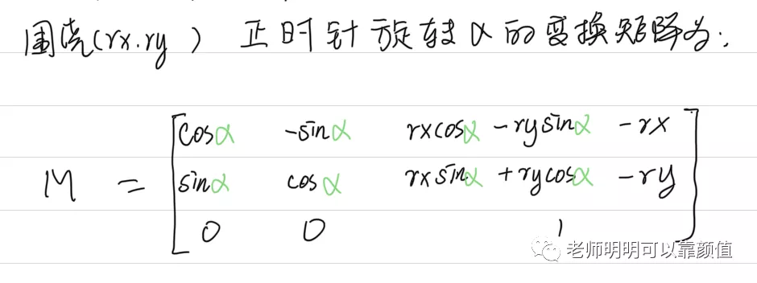

注意：

(x0,y0)为img0上的任意像素的坐标

(x1,y1)为img1上的任意像素的坐标

为什么旋转矩阵M要这样写，我们详细推导一下：

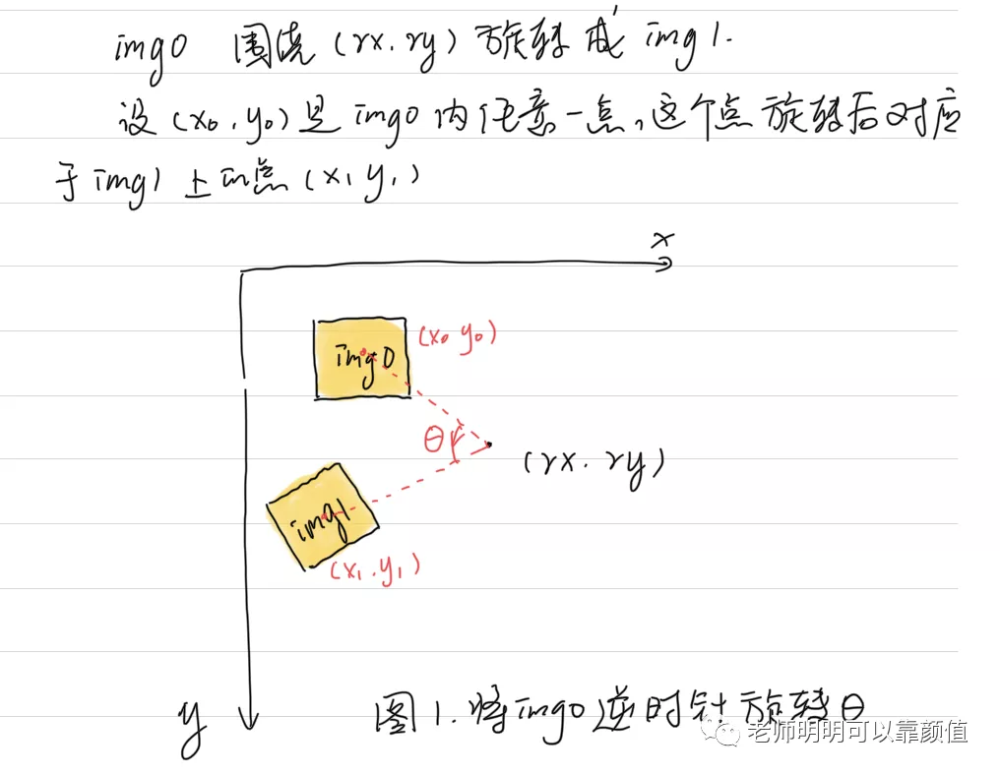

这里需要先了解仿射变换的基本操作方式，

回顾一下平移变换如下：

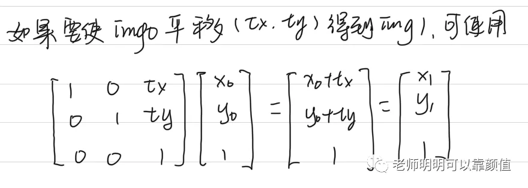

围绕原点θ的旋转变换如下：

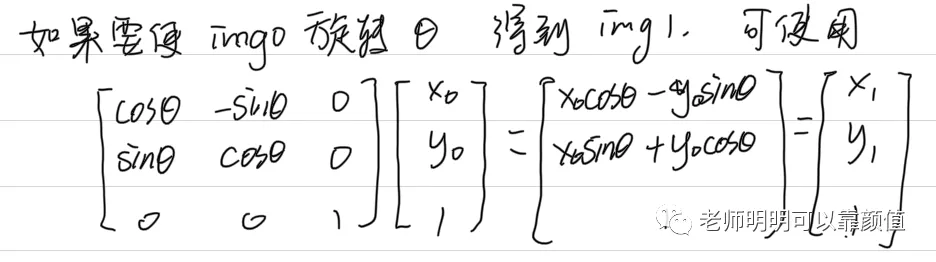

这里我们将围绕原点旋转为基本旋转变换。

其实我们可以利用平移变换和围绕原点(0,0)的旋转变换，来完成围绕任意点(rx,ry)的旋转变换，方法如下：

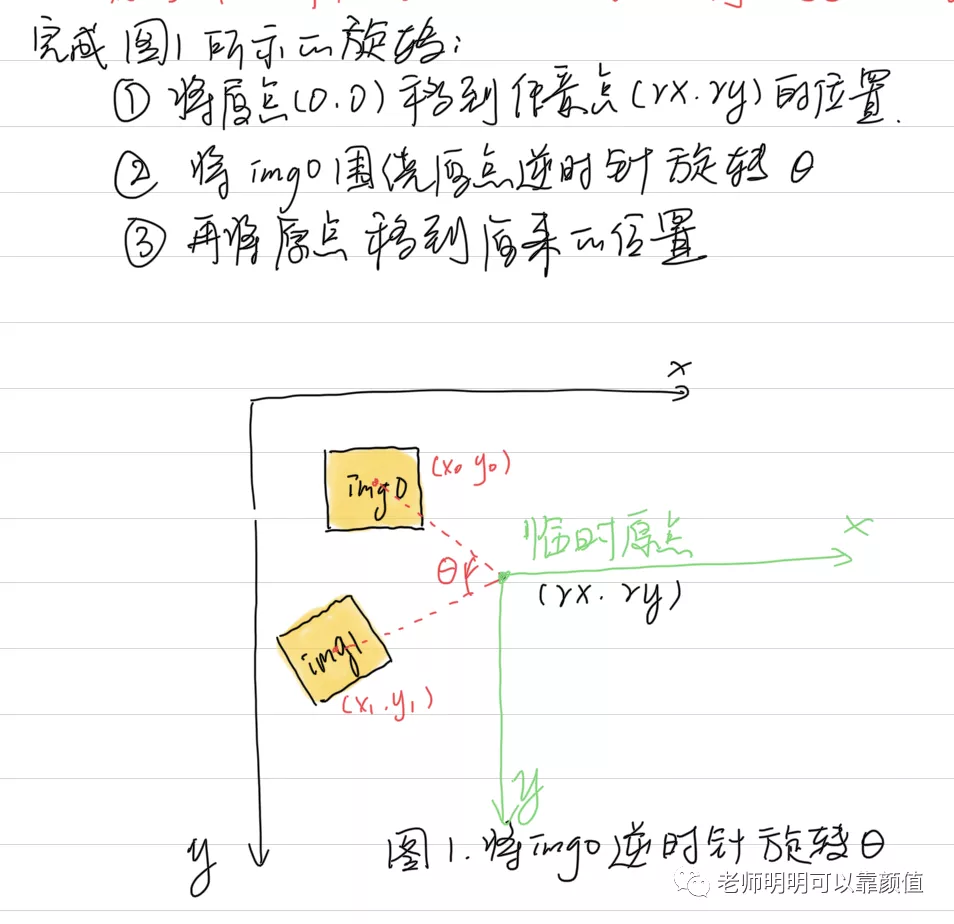

这三步的详细执行过程如下：

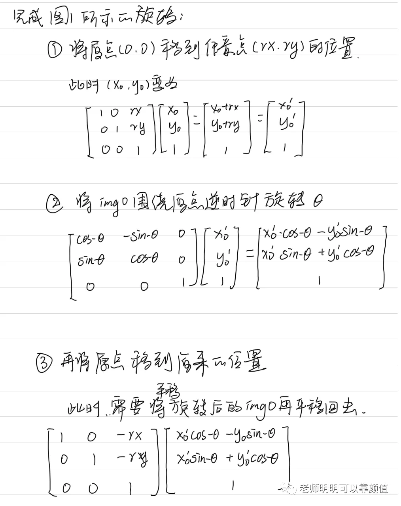

我们看到，每一步其实都是一个矩阵左乘的操作，所以我们可以把这三步的矩阵左乘合起来：

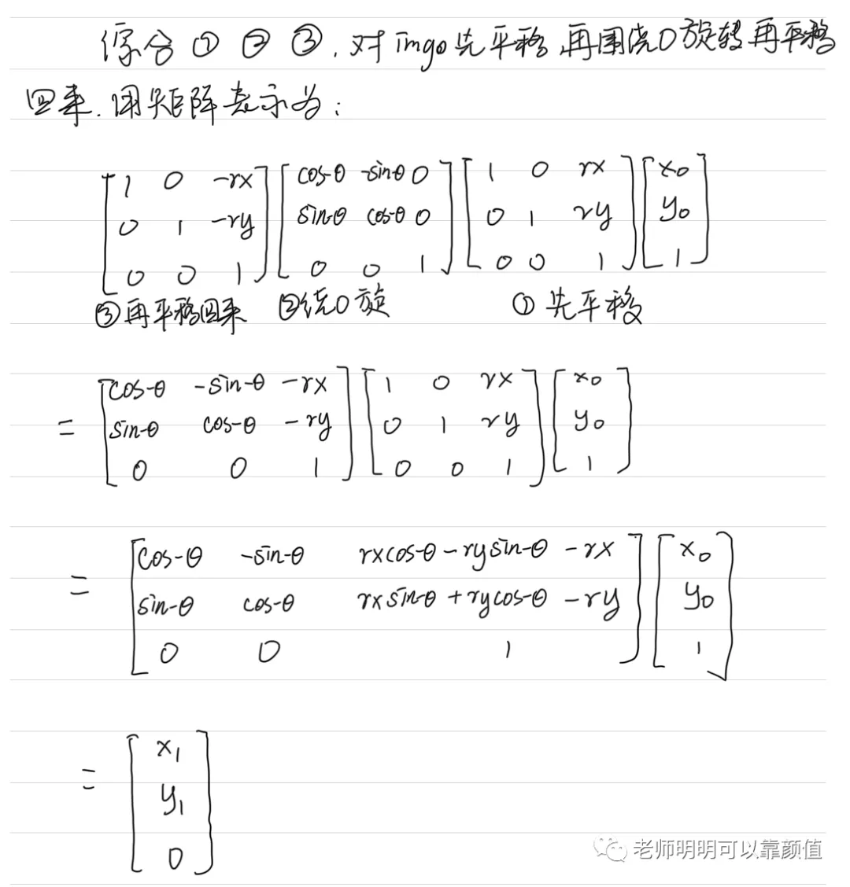

所以，对图片img0绕任意点(rx,ry)旋转的变换矩阵M可以总结为：

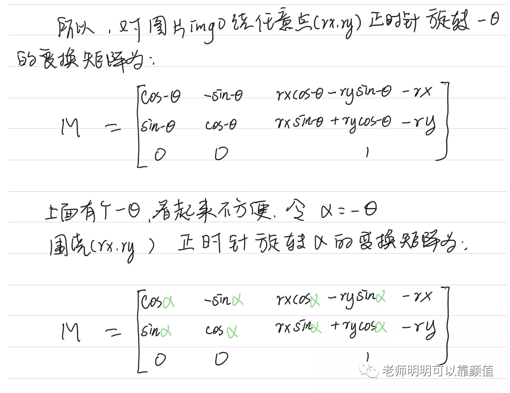

注意：我们图1中写的是逆时针旋转-theta，为了表述方便，我们令alpha = - theta,将负号去除。这样我们就总结出了绕任意点(rx,ry)顺时针旋转alpha的旋转矩阵M的公式

**疑问:**

- 1为什么矩阵左乘?

矩阵左乘相当于行变换 矩阵右乘相当于列变换

https://blog.csdn.net/csxiaoshui/article/details/65446125

https://blog.csdn.net/ningxuanyu5854/article/details/101905295

https://blog.csdn.net/silence1214/article/details/8634664

https://www.zhihu.com/question/263660493

**左乘：** 坐标系不动，点动，则左乘。【若绕静坐标系（世界坐标系）旋转，则左乘，也是变换矩阵乘坐标矩阵；】
**右乘：** 点不动，坐标系动，则右乘。【若是绕动坐标系旋转（自身建立一个坐标系），则右乘，也就是坐标矩阵乘变换矩阵】

从几何角度可以这里理解：左乘结果是 向量旋转 之后相对于原坐标系的位置， 右乘是参考系旋转移动后，向量(并未移动)相对于新参考系的坐标。


- 2为什么逆时针旋转公式是那样,没有顺时针旋转公式?

https://blog.csdn.net/csxiaoshui/article/details/65446125

https://blog.csdn.net/ningxuanyu5854/article/details/101905295

图示如下: 逆时针源自极坐标系的推导

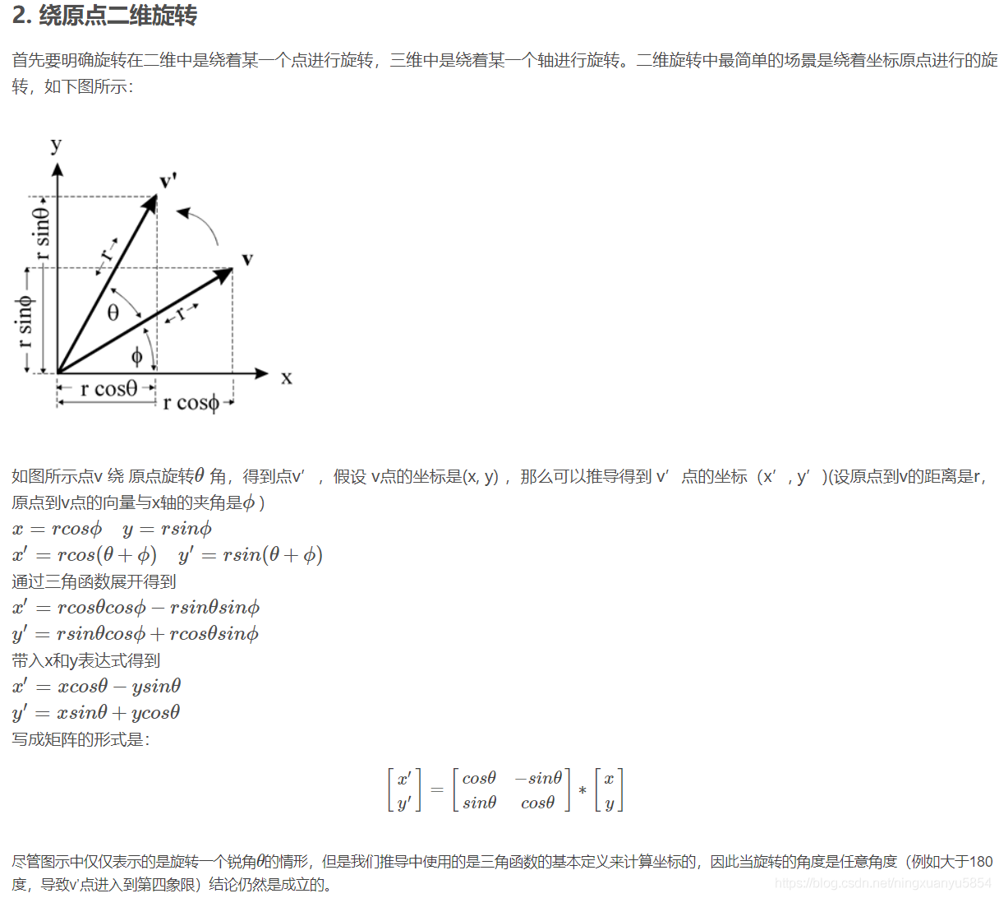


## 2. 旋转目标检测

https://github.com/NVIDIA/retinanet-examples/blob/main/odtk/box.py  NVIDIA加速旋转bbox-iou的计算


法1

https://zhuanlan.zhihu.com/p/114255617  几何方法-速度快

https://zhuanlan.zhihu.com/p/39717302 R-RPN文本检测

由于本文使用的是倾斜的候选框，所以基于水平候选框的IOU计算方法不再适应，因此本提出了倾斜IOU的计算方法，其主要思路就是将两个矩形框相交的点和矩形框内的点，然后将这些点集进行顺时针排序，使用三角形剖分法计算IOU．具体的算法步骤如下：

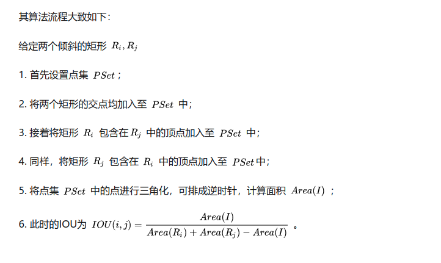

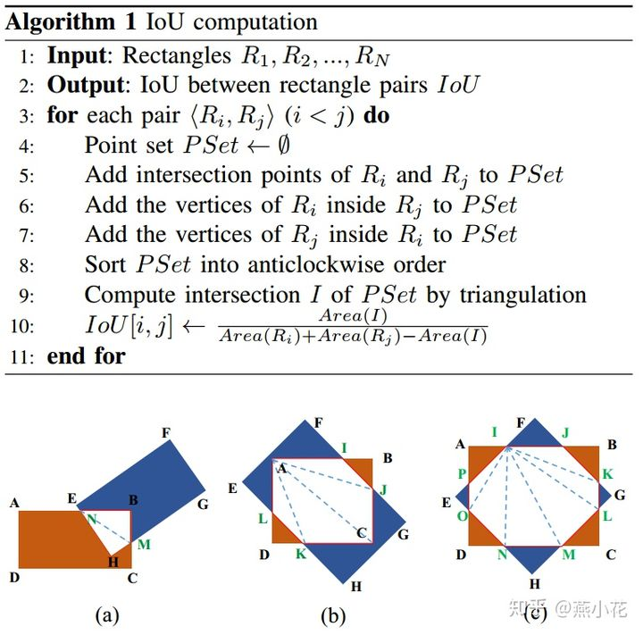

```python
from shapely.geometry import Polygon

def intersection(g, p):
    g=np.asarray(g)
    p=np.asarray(p)
    g = Polygon(g[:8].reshape((4, 2)))
    p = Polygon(p[:8].reshape((4, 2)))
    if not g.is_valid or not p.is_valid:
        return 0
    inter = Polygon(g).intersection(Polygon(p)).area
    union = g.area + p.area - inter
    if union == 0:
        return 0
    else:
        return inter/union
```


法2

https://stackoverflow.com/questions/44797713/calculate-the-area-of-intersection-of-two-rotated-rectangles-in-python

https://zhuanlan.zhihu.com/p/419560092  面积方法-简单

https://blog.csdn.net/hajungong007/article/details/96891987 任意两个旋转矩形的IOU计算方法

旋转bbox-iou 或多边形-iou

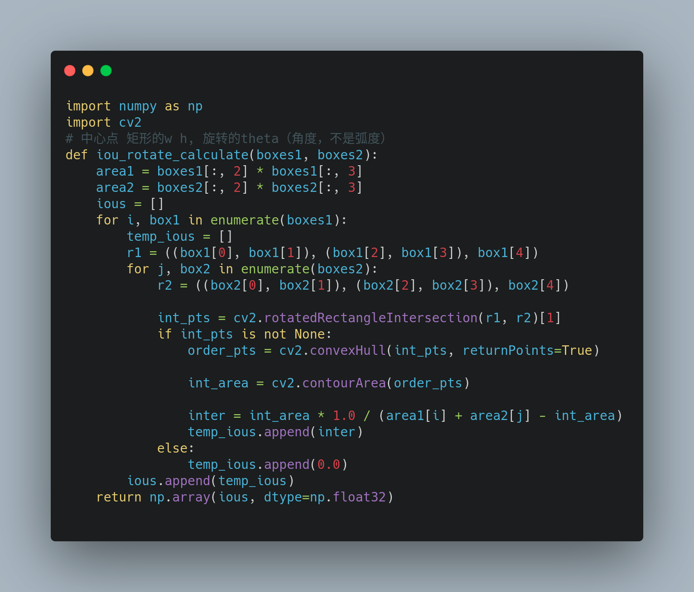


```python
import shapely.geometry
import shapely.affinity

class RotatedRect:
    def __init__(self, cx, cy, w, h, angle):
        self.cx = cx
        self.cy = cy
        self.w = w
        self.h = h
        self.angle = angle

    def get_contour(self):
        w = self.w
        h = self.h
        c = shapely.geometry.box(-w/2.0, -h/2.0, w/2.0, h/2.0)
        rc = shapely.affinity.rotate(c, self.angle)
        return shapely.affinity.translate(rc, self.cx, self.cy)

    def intersection(self, other):
        return self.get_contour().intersection(other.get_contour())


r1 = RotatedRect(10, 15, 15, 10, 30)
r2 = RotatedRect(15, 15, 20, 10, 0)

from matplotlib import pyplot
from descartes import PolygonPatch

fig = pyplot.figure(1, figsize=(10, 4))
ax = fig.add_subplot(121)
ax.set_xlim(0, 30)
ax.set_ylim(0, 30)

ax.add_patch(PolygonPatch(r1.get_contour(), fc='#990000', alpha=0.7))
ax.add_patch(PolygonPatch(r2.get_contour(), fc='#000099', alpha=0.7))
ax.add_patch(PolygonPatch(r1.intersection(r2), fc='#009900', alpha=1))

pyplot.show()
```

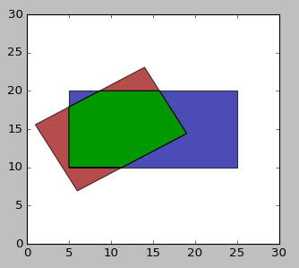

```python
from math import pi, cos, sin


class Vector:
    def __init__(self, x, y):
        self.x = x
        self.y = y

    def __add__(self, v):
        if not isinstance(v, Vector):
            return NotImplemented
        return Vector(self.x + v.x, self.y + v.y)

    def __sub__(self, v):
        if not isinstance(v, Vector):
            return NotImplemented
        return Vector(self.x - v.x, self.y - v.y)

    def cross(self, v):
        if not isinstance(v, Vector):
            return NotImplemented
        return self.x*v.y - self.y*v.x


class Line:
    # ax + by + c = 0
    def __init__(self, v1, v2):
        self.a = v2.y - v1.y
        self.b = v1.x - v2.x
        self.c = v2.cross(v1)

    def __call__(self, p):
        return self.a*p.x + self.b*p.y + self.c

    def intersection(self, other):
        # See e.g.     https://en.wikipedia.org/wiki/Line%E2%80%93line_intersection#Using_homogeneous_coordinates
        if not isinstance(other, Line):
            return NotImplemented
        w = self.a*other.b - self.b*other.a
        return Vector(
            (self.b*other.c - self.c*other.b)/w,
            (self.c*other.a - self.a*other.c)/w
        )


def rectangle_vertices(cx, cy, w, h, r):
    angle = pi*r/180
    dx = w/2
    dy = h/2
    dxcos = dx*cos(angle)
    dxsin = dx*sin(angle)
    dycos = dy*cos(angle)
    dysin = dy*sin(angle)
    return (
        Vector(cx, cy) + Vector(-dxcos - -dysin, -dxsin + -dycos),
        Vector(cx, cy) + Vector( dxcos - -dysin,  dxsin + -dycos),
        Vector(cx, cy) + Vector( dxcos -  dysin,  dxsin +  dycos),
        Vector(cx, cy) + Vector(-dxcos -  dysin, -dxsin +  dycos)
    )

def intersection_area(r1, r2):
    # r1 and r2 are in (center, width, height, rotation) representation
    # First convert these into a sequence of vertices

    rect1 = rectangle_vertices(*r1)
    rect2 = rectangle_vertices(*r2)

    # Use the vertices of the first rectangle as
    # starting vertices of the intersection polygon.
    intersection = rect1

    # Loop over the edges of the second rectangle
    for p, q in zip(rect2, rect2[1:] + rect2[:1]):
        if len(intersection) <= 2:
            break # No intersection

        line = Line(p, q)

        # Any point p with line(p) <= 0 is on the "inside" (or on the boundary),
        # any point p with line(p) > 0 is on the "outside".

        # Loop over the edges of the intersection polygon,
        # and determine which part is inside and which is outside.
        new_intersection = []
        line_values = [line(t) for t in intersection]
        for s, t, s_value, t_value in zip(
            intersection, intersection[1:] + intersection[:1],
            line_values, line_values[1:] + line_values[:1]):
            if s_value <= 0:
                new_intersection.append(s)
            if s_value * t_value < 0:
                # Points are on opposite sides.
                # Add the intersection of the lines to new_intersection.
                intersection_point = line.intersection(Line(s, t))
                new_intersection.append(intersection_point)

        intersection = new_intersection

    # Calculate area
    if len(intersection) <= 2:
        return 0

    return 0.5 * sum(p.x*q.y - p.y*q.x for p, q in
                     zip(intersection, intersection[1:] + intersection[:1]))


if __name__ == '__main__':
    r1 = (10, 15, 15, 10, 30)
    r2 = (15, 15, 20, 10, 0)
    print(intersection_area(r1, r2))
```

## 3. GIOU-loss   DIOU-loss(旋转bbox)

参考:

https://github.com/lilanxiao/Rotated_IoU


